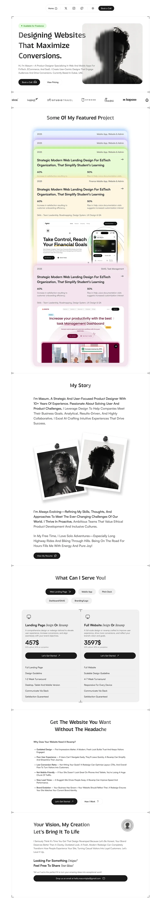

# Design reference

`reference.webp` is the owner's inspiration (a freelance designer's landing page). The site keeps its visual language and adapts the content to a software engineer's portfolio.

## What we took from it
| Element | Implementation |
|---|---|
| Floating pill nav with socials, theme toggle and "Book a Call" | `src/components/layout/site-nav.tsx` |
| Framed page with hairline borders and crop-mark ticks | Dropped at the owner's request (2026-09-29); sections are separated by spacing only |
| Hero: availability badge, large gradient headline, portrait with frosted vertical strips | `src/components/home/hero.tsx` |
| Logo strip under the hero | Tech-stack marquee (`marquee` on `profile`) |
| Featured projects as stacked, tinted, glowing cards | Sticky stack in `src/components/projects/featured-projects.tsx`; colour per project (`tint`) |
| "My Story" with bold lead-ins over muted text, pinned polaroids, résumé button | `src/components/home/story.tsx`; bold text in the rich-text editor renders in full colour |
| Service tabs and two-column pricing cards with italic accent words | `src/components/home/services.tsx`; `*word*` in a title renders in the accent font, price is optional |
| Contact block with rotating badge and full-width email button | `src/components/home/contact.tsx` |

## Deviations
- **Blog section** is not in the reference; it reuses the card language (muted card, pills, arrow link).
- **"Get the website you want…" sales section** was left out: it is design-agency copy with no equivalent for this portfolio.
- **Portrait**: until a photo is uploaded in `/admin` (Profile → Hero → Portrait) the hero shows a monogram.

## Tokens
- **Fonts**: Lexend (body and headings, the owner's choice), Instrument Serif italic (accent words). Loaded with `next/font` in `src/app/(frontend)/layout.tsx`.
- **Colour**: neutral shadcn tokens in `src/app/(frontend)/globals.css`, light by default with a dark theme. Accent colours used outside the tokens, all taken from the reference: the emerald availability badge and the five project tints (`src/components/projects/tints.ts`).
- **Shape**: pill buttons (`rounded-full`, set in `src/components/ui/button.tsx`), `rounded-3xl` cards.
- **Motion**: marquee, rotating badge, sticky card stacking; marquee and badge stop under `prefers-reduced-motion`.
